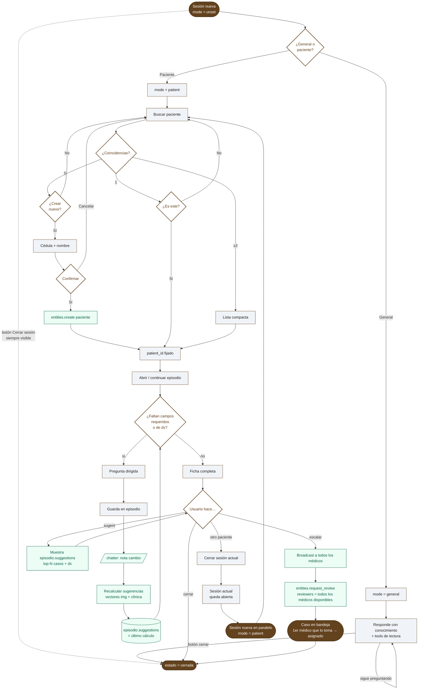

# Flujo del chatbot CEPI

> Borrador v0.2 — comportamiento conversacional esperado del asistente médico.
> Principios rectores: lenguaje natural, respuestas cortas, no repreguntar lo
> que ya se sabe, formularios cerrados cuando aplique.

## 1. Principios

- **Brevedad**: cada turno del bot ≤ 2 líneas salvo formulario o resumen explícito.
- **Contexto primero**: el bot no responde nada clínico sin saber si está en
  *consulta general* o *atención a paciente*.
- **No re-preguntar**: si un dato ya está en la ficha del paciente activo, no
  pedirlo de nuevo (mostrarlo y pedir confirmación si parece desactualizado).
- **Formularios cerrados**: para campos enumerados (sexo, severidad, sí/no)
  usar quick-replies, no texto libre.
- **Confirmation gate**: toda escritura clínica se confirma antes de persistir
  (PAPER §13.3.1).
- **Sólo el bot opera tools**: la UI no expone comandos al usuario salvo el
  composer + un botón explícito "Cerrar sesión". Sin shortcuts laterales.
- **Una sesión = una conversación médico↔bot sobre un paciente o un tema
  general**: pueden coexistir varias sesiones abiertas en paralelo. Sólo
  *escalar* o el botón explícito *Cerrar sesión* la cierran; *otro
  paciente* deja la actual abierta y abre una segunda en paralelo.

## 2. Estado conversacional

```
mode:           'unset' | 'general' | 'patient'
patient_id:     string | null
episode_id:     string | null
pending_action: { tool, args, summary } | null
form:           { kind, fields, partial } | null
estado:         'abierta' | 'cerrada'
```

`mode` arranca en `unset` y la sesión arranca en `abierta`. No hay estado `draft`.

## 3. Pipeline (alto nivel)



## 4. Apertura — la pregunta inicial

La pregunta **"¿Es una consulta general o atención a un paciente?"** está
**hardcoded en la UI** (welcome screen del frontend) con dos quick-replies:
*Consulta general* / *Atención a paciente*. El bot **nunca** la formula —
asume que el frontend la mostró.

Cuando el usuario clickea un botón, se envía `general` o `paciente` como
primer mensaje. El bot setea `mode` y sigue.

Si en lugar de elegir el usuario tipea cualquier otra cosa con `mode = unset`,
el bot **asume `general`** silenciosamente y procesa el mensaje.

## 5. Modo `general`

El bot responde con su conocimiento + tools de lectura (`entities.list`,
`entities.get`, etc.). No abre flujo clínico, no toca `pending_action`. La
sesión queda **abierta** hasta que el usuario presione el botón **Cerrar
sesión** (UI) o tipee uno de los comandos de cierre.

## 6. Modo `patient`

### 6.1 Selección de paciente

Bot:
> Buscar paciente:
> [input: cédula o nombre] [+ Nuevo paciente]

Resultados:
- 0 hits → "Sin coincidencias. ¿Crear nuevo?" `[Sí]` `[Reintentar]`
- 1 hit → "¿Es {nombre}, {cédula}?" `[Sí]` `[No]`
- ≥2 hits → lista compacta (máx 5) con botones.

Al confirmar, `patient_id` queda fijo para la sesión.

### 6.2 Paciente nuevo

Formulario mínimo:
- Cédula (requerido, único)
- Nombre (requerido)

Confirmation gate:
> Crear paciente {nombre} / {cédula}? `[Confirmar]` `[Cancelar]`

El resto de los campos se pide *cuando hagan falta* en el flujo clínico.

### 6.3 Apertura / continuación de episodio

Con `patient_id` fijo, el bot abre o continúa un episodio (entidad
`episodio`). El episodio agrupa toda la información que se aporta en la
sesión y es el sujeto del recálculo de sugerencias.

### 6.4 Política de campos — qué pregunta y qué no

Antes de pedir un dato, el bot consulta la ficha del paciente y los datos
ya guardados en el episodio:

- **No existe** → pregunta. Si el campo es enumerado, formulario cerrado.
- **Existe y reciente** → usa sin preguntar.
- **Existe y posiblemente desactualizado** → muestra valor + pide confirmación:
  > Peso registrado: 72 kg (hace 8 meses). ¿Sigue vigente? `[Sí]` `[Actualizar]`

Heurística de "desactualizado" (configurable por campo en
`entity_definition.config.fields[].stale_after`, futura):

| Campo | Umbral |
|---|---|
| Signos vitales | > 1 día (en episodio activo) |
| Peso / talla | > 6 meses |
| Medicación activa | > 3 meses |
| Alergias / antecedentes | sólo confirmar primera vez por episodio |

### 6.5 Criterio de "ficha completa"

La ficha se considera completa cuando están presentes:

1. Todos los **campos `status: required`** del `entity_definition` de episodio.
2. Todos los **campos relevantes para el diagnóstico** según el motivo de
   consulta.

El conjunto "relevantes para dx" es **hoy un punto abierto** — ver §10.1.

Mientras el bot detecte que falta algún campo de cualquiera de los dos
grupos, hace una pregunta dirigida (loop campo a campo), no presenta
todo el formulario de golpe.

### 6.6 Sugerencias clínicas

Cada vez que el usuario aporta un dato nuevo:

1. El bot guarda el dato en el episodio.
2. Deja una nota en el **chatter** del episodio (auditoría + historial
   completo de cómo evolucionaron las sugerencias).
3. Recalcula las sugerencias: combina el embedding de las imágenes
   clínicas adjuntas + los datos textuales del episodio para producir
   - **Casos similares** (top-N pacientes/episodios cercanos en el
     espacio vectorial).
   - **Diagnósticos candidatos** (top-N CIE-10 con confianza).
4. Sobre-escribe `episodio.suggestions` con el último resultado.

`episodio.suggestions` guarda **sólo el último cálculo**. El histórico vive
en el chatter como notas firmadas por el bot.

**El bot no muestra las sugerencias por iniciativa propia.** Las computa
y persiste en silencio. Sólo las exhibe cuando el usuario las pide
explícitamente (ej. "sugerencias", "casos similares", "qué piensas").

Cuándo dispara el recálculo (sync / async / lazy) — **abierto**, ver §10.2.

## 7. Cierre y cambios de contexto

### 7.1 Acciones explícitas del usuario

| Acción | Efecto |
|---|---|
| Botón **Cerrar sesión** (UI) o tipear `cerrar sesión` / `cerrar chat` | `estado = cerrada`. La sesión queda en la lista de la barra lateral con la etiqueta *cerrada*. |
| `otro paciente` | **No cierra** la sesión actual: sigue `abierta`. Spawnea una sesión **en paralelo** (`mode = patient`, sin paciente fijado) lista para buscar. El médico puede volver a la previa desde la lista del sidebar cuando quiera. |
| `escalar` | Ver §7.2. |

### 7.2 Escalamiento

`escalar` → el bot llama a `entities.request_review` con `reviewers =
[todos los médicos disponibles]` (broadcast). El caso aparece en la
bandeja de revisión de cada médico.

El **primer médico que toma el caso** se queda asignado; el resto pierde
visibilidad sobre él. Inmediatamente después del request, **se cierra la
sesión actual** (`estado = cerrada`).

Una sesión = una conversación médico↔bot. Escalar implica otro médico,
por lo tanto otra sesión.

## 8. Confirmation gate

Toda mutación pasa por `pending_action`:

> Voy a registrar:
> • Episodio nuevo, motivo: cefalea
> • Síntoma: náusea
> `[Confirmar]` `[Cancelar]`

Una sola confirmación puede agrupar varias escrituras del mismo turno.

## 9. Estilo de respuesta

- Máx 2 líneas de prosa por turno.
- Listas con viñetas sólo en resúmenes.
- Nunca repetir lo que el usuario acaba de decir.
- Nunca explicar el flujo del bot al usuario salvo que pregunte.

## 10. Decisiones abiertas

### 10.1 Quién decide los "campos relevantes para dx"

Tres opciones:

| Opción | Cómo funciona | Trade-off |
|---|---|---|
| (a) **Bot al vuelo** | El LLM lee el motivo y decide qué preguntar en cada turno. | Flexible pero impredecible; difícil de testear. |
| (b) **Tabla seedeada** | `clinical_relevance_rules` con `motivo → [campos]`, editable desde el ERP. | Determinista, hay que mantenerla. |
| (c) **Híbrido** | Tabla por defecto + el bot puede sumar preguntas si detecta algo raro. | Más complejo. |

### 10.2 Cuándo se calculan las sugerencias

| Opción | Costo | UX |
|---|---|---|
| (a) Sync en el mismo turno | Alto | Usuario espera al bot |
| (b) Async en background | Igual costo, fuera de turno | Bot responde rápido; sugerencias listas la próxima vez que se piden |
| (c) Lazy: sólo al pedir | Caro al pedir | Sugerencias siempre frescas pero "/sugerir" es lento |

### 10.3 Otros pendientes

- ¿`general` puede acceder a datos agregados de pacientes (métricas
  globales) o sólo a docs?
- ¿Multi-paciente en un mismo turno (comparar dos casos)? — fuera de
  alcance v1.
- ¿Persistir el `mode` entre sesiones del mismo médico? — probablemente
  no, mejor preguntar siempre.
